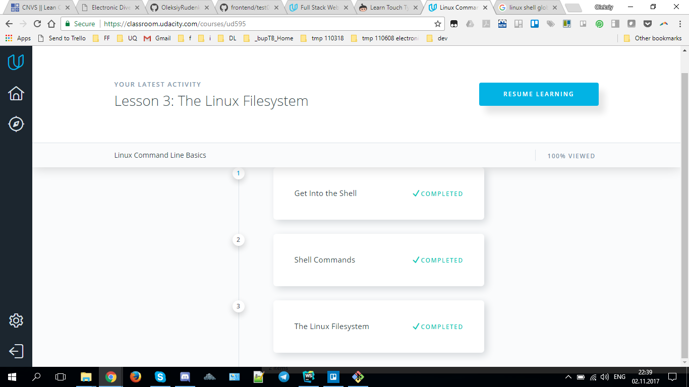
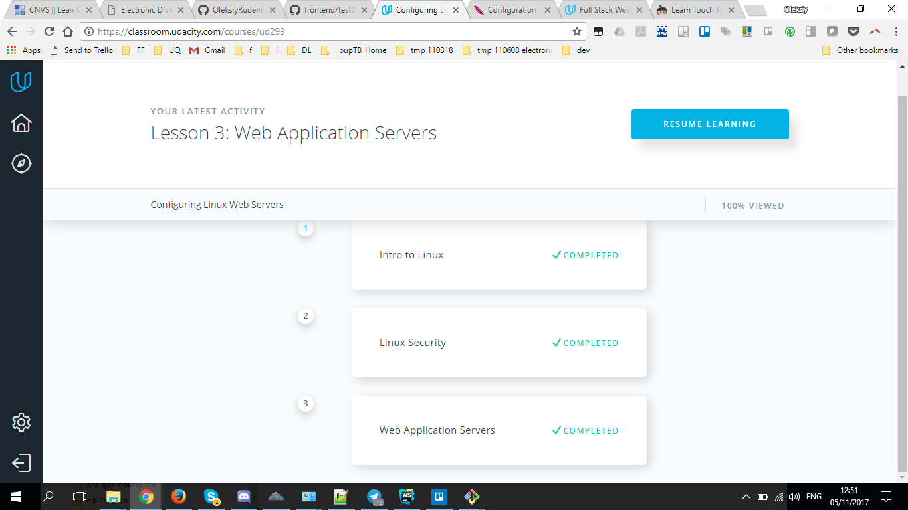
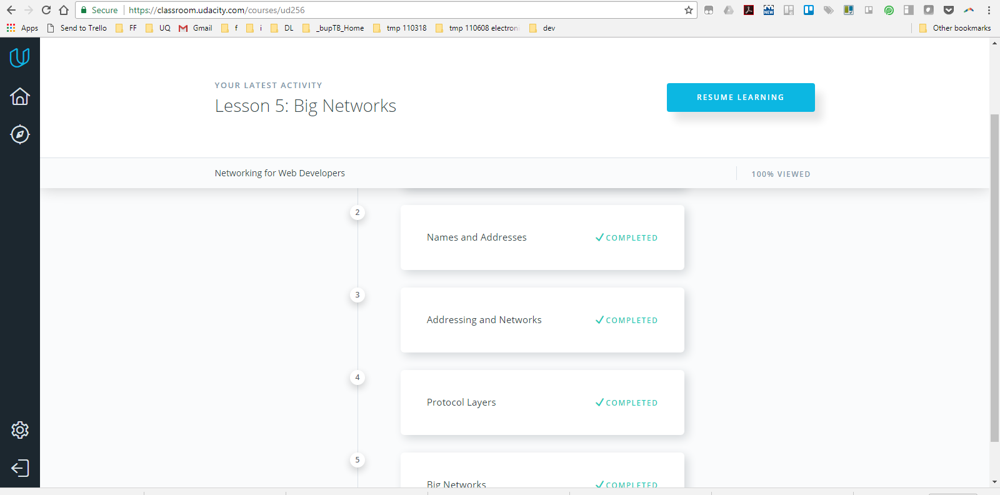
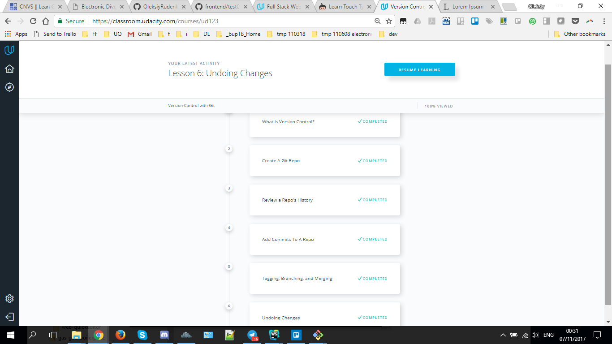
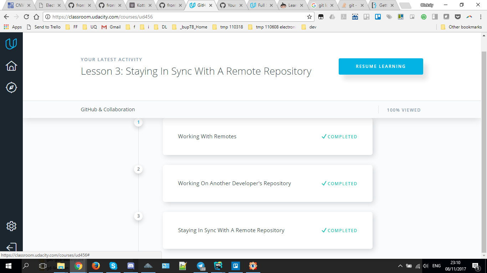
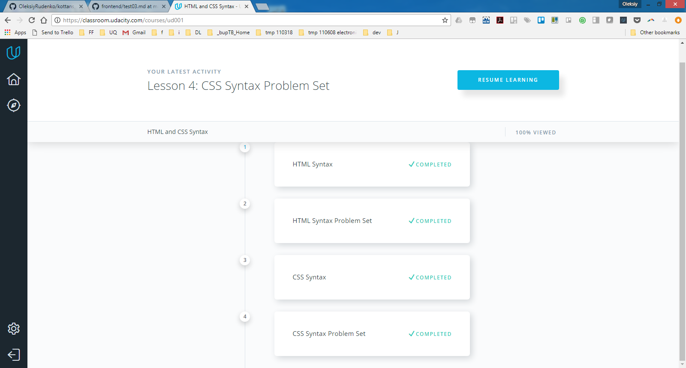
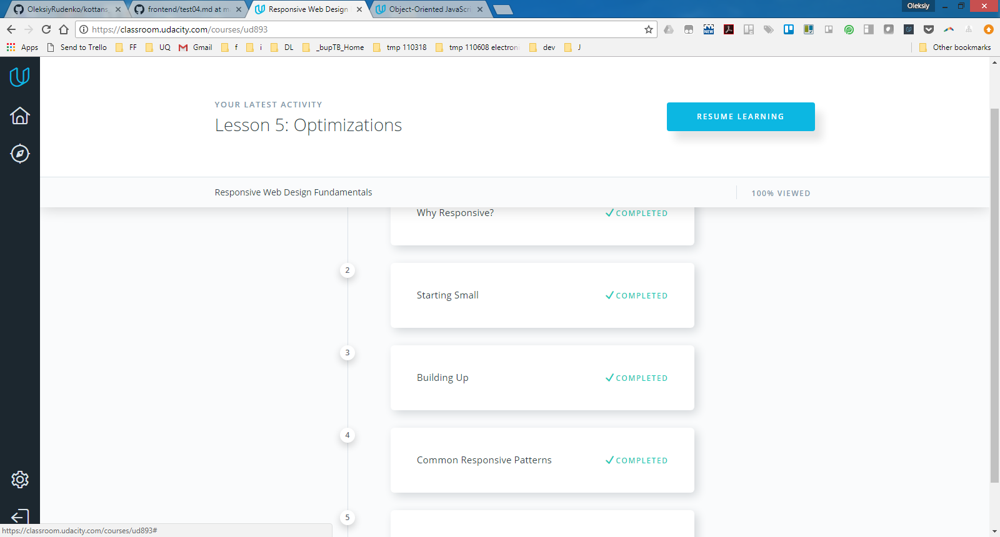
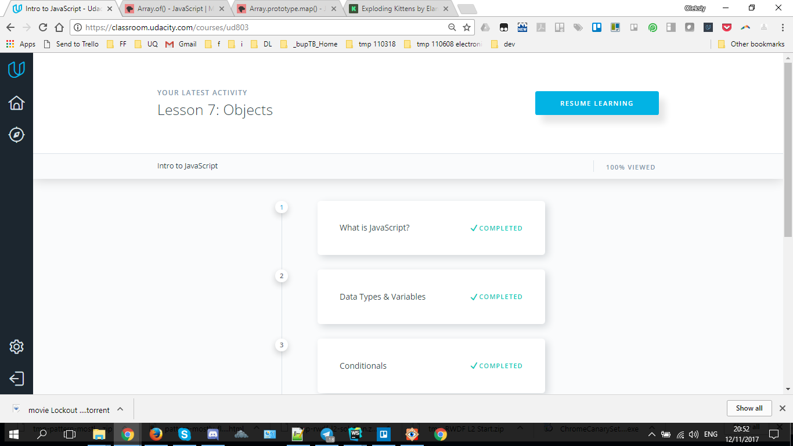
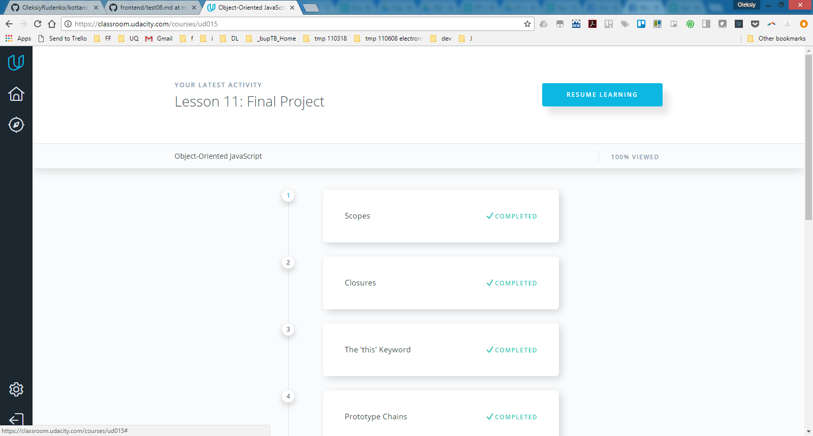

# Kottans Frontend Course Reflections

`[171023]` - initialized

This is a reflections register to be completed while
passing [Kottans frontend course](https://github.com/Kottans/frontend).

<!-- START doctoc generated TOC please keep comment here to allow auto update -->
<!-- DON'T EDIT THIS SECTION, INSTEAD RE-RUN doctoc TO UPDATE -->
## Table of Contents

- [Legend](#legend)
- [Courses Pathway](#courses-pathway)
- [Kottans Course Tasks](#kottans-course-tasks)
  - [Task 0 - Getting familiar with Git and Github](#task-0---getting-familiar-with-git-and-github)
  - [Test 1 - Linux command line, server and http tools](#test-1---linux-command-line-server-and-http-tools)
  - [Test 2 - More of git and github](#test-2---more-of-git-and-github)
  - [Test 3 - Frontend basics](#test-3---frontend-basics)
  - [Test 4 - Responsive Web Design Fundamentals](#test-4---responsive-web-design-fundamentals)
  - [Test 5 - Intro to JS](#test-5---intro-to-js)
  - [Test 6 - Object-Oriented JavaScript](#test-6---object-oriented-javascript)
    - [Course project: Classical Frogger Game](#course-project-classical-frogger-game)
  - [Test 7 - Offline Web Applications](#test-7---offline-web-applications)
  - [Test 8 - Memory Pair Game](#test-8---memory-pair-game)
  - [Test 9 - Website Performance Optimization](#test-9---website-performance-optimization)
  - [Test 10 - Weather Web App](#test-10---weather-web-app)
- [Going to learn](#going-to-learn)
  - [Git related](#git-related)
  - [Responsive design](#responsive-design)
  - [Misc skills](#misc-skills)

<!-- END doctoc generated TOC please keep comment here to allow auto update -->

## Legend

Each article studied is commented with three reflection items:
 * `new----- :` what was new to me
 * `surprise :` what has surprised me
 * `will use :` what I shall use

`[171024]` - occasionally date in format `[YYMMDD]` can be specified
for future reference.

[TOC :arrow_double_up: ](#table-of-contents)

## Courses Pathway

 - [x] [How to Use Git and GitHub](https://www.udacity.com/course/how-to-use-git-and-github--ud775)
 - [x] [try.github.io](https://try.github.io/levels/1/challenges/1)
 - [x] fork/PR [Kottans/mock-repo@github](https://github.com/Kottans/mock-repo)
 - [x] [Linux Command Line Basics](https://www.udacity.com/course/linux-command-line-basics--ud595)
 - [x] [Configuring Linux Web Servers](https://www.udacity.com/course/configuring-linux-web-servers--ud299)
 - [x] [Networking for Web Developers](https://www.udacity.com/course/networking-for-web-developers--ud256)
 - [x] [Version Control with Git](https://classroom.udacity.com/courses/ud123/)
 - [x] [GitHub & Collaboration](https://classroom.udacity.com/courses/ud456)
 - [x] [HTML and CSS Syntax](https://www.udacity.com/course/intro-to-html-and-css--ud304)
 - [x] [Responsive Web Design Fundamentals by Google](https://www.udacity.com/course/responsive-web-design-fundamentals--ud893)
 - [x] [Intro to JavaScript](https://www.udacity.com/course/intro-to-javascript--ud803)
 - [x] [Object-Oriented JavaScript by Hack Reactor](https://www.udacity.com/course/object-oriented-javascript--ud015)
 - [ ] [Offline Web Applications](https://www.udacity.com/course/offline-web-applications--ud899)

[TOC :arrow_double_up: ](#table-of-contents)

## Kottans Course Tasks

### Task 0 - Getting familiar with Git and Github

 * Git and GitHub basics (##1,2)
     - `new----- :` tuning up Git Environment, PRs
     - `surprise :` git flexibility
     - `will use :` many techniques, e.g. conflict resolution, github PR
 * Create this repo and README.md with impressions (##3,4,5)
     - `new----- :` peace of cake
     - `surprise :` not much, really
     - `will use :` again and again
 * Pull requests to [Kottans/mock-repo](https://github.com/Kottans/mock-repo) (#6)
     - `new----- :` pull request process
     - `surprise :` couldn't pick particular change for the merger, and
       [skip unnecessary file](#git-related)
     - `will use :` pull request technique

[TOC :arrow_double_up: ](#table-of-contents)

### Test 1 - Linux command line, server and http tools
[The original task from Kottans](https://github.com/Kottans/frontend/blob/master/test01.md)

Completed lessons evidences:

 
 
 

 

Reflections:
 * Linux Command Line Basics (#1)
     - `new----- :` Vagrant
     - `surprise :` control of every aspect of OS
     - `will use :` Vagrant
 * Configuring Linux Web Servers (#2)
     - `new----- :` serving HTTP from VM
     - `surprise :` complicated dependecies
     - `will use :` web-server from VM
 * Networking for Web Developers (#3)
     - `new----- :` `nc` (netcat) untility; `NAT` mechanics
     - `surprise :` easyness of traffic interception for debug tasks;
                    `traceroute` mechanics
     - `will use :` TCP mechanics knowledge
 * HTTP: The Protocol Every Web Developer Must Know (##4,5)
     - `new----- :` TRACE, OPTIONS verbs;
                    how web query & response get transformed into
                    request/response messages;
                    TLS is SSL+; Cache-Control;
     - `surprise :` multiple HTTP auth methods;
                    `407 Unauthorized` is not a dead-end
     - `will use :` RFC-2616

[TOC :arrow_double_up: ](#table-of-contents)

### Test 2 - More of git and github

[The original task from Kottans](https://github.com/Kottans/frontend/blob/master/test02.md)

Completed lessons evidences:

 
 
 

Reflections:
 * Version Control with Git (#0)
     - `new----- :` `git reset --mixed|soft`
     - `surprise :` quite transparent difference between resetting modes
     - `will use :` `git reset`
 * GitHub & Collaboration (#2)
     - `new----- :` squashing commits; backup branch before rebasing
     - `surprise :` rebasing is not so scary
     - `will use :` squashing/rebasing

[TOC :arrow_double_up: ](#table-of-contents)

### Test 3 - Frontend basics

[The original task from Kottans](https://github.com/Kottans/frontend/blob/master/test03.md)

Completed lessons evidences:

 

Reflections:
 * HTML and CSS Syntax
     - `new----- :` pseudo-classes, pseudo-elements
     - `surprise :` CSS became quite powerful
     - `will use :` extended selectors

[TOC :arrow_double_up: ](#table-of-contents)

### Test 4 - Responsive Web Design Fundamentals

[The original task from Kottans](https://github.com/Kottans/frontend/blob/master/test04.md)

<b>Completed lessons evidences</b> (click to show)

 

Reflections:
 * Responsive Web Design Fundamentals
     - `new----- :` CSS flex support
     - `surprise :` what I thought was a sophisticated CSS tricks is
                    actually supported out-of-box
     - `will use :` responsive design

[TOC :arrow_double_up: ](#table-of-contents)

### Test 5 - Intro to JS

[The original task from Kottans](https://github.com/Kottans/frontend/blob/master/test05.md)

<b>Completed lessons evidences</b> (click to show)

 

Reflections:
 * Intro to JS
     - `new----- :` logical operators in imperative statements may return
                    sub-statement value 
     - `surprise :` the above
     - `will use :` the above

[TOC :arrow_double_up: ](#table-of-contents)

### Test 6 - Object-Oriented JavaScript

[The original task from Kottans](https://github.com/Kottans/frontend/blob/master/test06.md)

<b>Completed lessons evidences</b> (click to show)

 

#### Course project: Classical Frogger Game

[repo](https://github.com/OleksiyRudenko/frontend-nanodegree-arcade-game)
| [live](https://oleksiyrudenko.github.io/frontend-nanodegree-arcade-game)

Reflections:
 * Object-Oriented JS
     - `new----- :` class declaration patterns
     - `surprise :` OO optimization based on patterns applied
     - `will use :` pseudoclassical pattern (classes and subclasses)

[TOC :arrow_double_up: ](#table-of-contents)

### Test 7 - Offline Web Applications

Reflections:
 * Offline Web Applications
     - `new----- :` [IndexedDB Promised](https://github.com/jakearchibald/idb),
       Cache Storage
     - `surprise :` cache and IndexedDB
     - `will use :` service workers, IndexedDB

[TOC :arrow_double_up: ](#table-of-contents)

### Test 8 - Memory Pair Game

[repo](https://github.com/OleksiyRudenko/memory-pair-game)
| [Play on-line!](https://oleksiyrudenko.github.io/memory-pair-game/)

Reflections:
 * Memory Pair Game
     - `new----- :` complete real task
     - `surprise :` _this_ context via `()=>{}` works like a charm
     - `will use :` Object Oriented approach

[TOC :arrow_double_up: ](#table-of-contents)

### Test 9 - Website Performance Optimization

Reflections:
 * Website Performance Optimization
     - `new----- :` JS Engines internals
     - `surprise :` Critical Rendering Path 
     - `will use :` Performance optimization techniques

[TOC :arrow_double_up: ](#table-of-contents)

### Test 10 - Weather Web App

Reflections:
 - Planning, planning, and even better planning
 - Architecture worth time thinking over 
 - Theory, theory, and even more theory
 - Practice, practice, practice, practice, and loop again

**[Features](https://github.com/OleksiyRudenko/weather-webapp#features):**

 * Search by City name
 * Search by geo coordinates
 * Current weather and 5 days forecast
 * 20 latest cities searched are available in history track
   (stored per browser)
 * Switch between imperial and metric units
   (stored per browser)
 * [Open Weather Map](https://openweathermap.org/api) is a weather
   data source

**Feature stubs:**

 * Detect current location
 * Favourites management
 * Pre-loaded city list
 * Weather cache for offline use

**[Known Issues](https://github.com/OleksiyRudenko/weather-webapp#known-issues):**

 - [ ] Styling is poor
 - [ ] Forecast data removal is done not via style management
 - [ ] Current location not detected
 - [ ] Pre-loaded city list is not used
 - [ ] Favourites management is not implemented
 - [ ] Favourites drop-down is not implemented
 - [ ] Search by geo coordinates is not validated
 - [ ] Search errors are technical in style

[Live demo](https://oleksiyrudenko.github.io/weather-webapp/)

[repo @ github](https://github.com/OleksiyRudenko/weather-webapp)

[TOC :arrow_double_up: ](#table-of-contents)

## Going to learn

### Git related

 - [x] Skipping files on pull request. For e.g. the target repo
       doesn't contain `.gitignore`, and I need it to make my life
       a bit easier: have it and avoid extra steps on ignoring its
       existence at every git action.
       How to remove this file from the pull request scope?
       -- Populate your `~/.gitignore`
       and do `git config --global core.excludesfile ~/.gitignore`
 - [x] Post Pull Request activity:
   - [x] merge to forked master? - if PR's successful, merge master from upstream
   - [x] just kill the branch? - kill it upon PR complete

### Responsive design

 * [ ] [CSS in-depth](https://trello.com/c/xvMOErwb)
 * [ ] [Responsive Images Course](https://www.udacity.com/course/responsive-images--ud882)
 * [ ] [Finish extras](https://github.com/kottans/frontend/blob/master/test04.md)

### Misc skills

 * [ ] [Improve typing skills](https://www.typingclub.com/)
 * [ ] [Git It!](https://github.com/jlord/git-it-electron)
 * [ ] [ES6 Template Strings](http://2ality.com/2015/01/template-strings-html.html)
 * [ ] [A Marvelous World of Coding Conventions@youtube](https://www.youtube.com/watch?v=1ad32_m1nZo)
 * [ ] [Service Workers](https://habrahabr.ru/post/279291/) + [more...](https://trello.com/c/zw6YQuLK)

[TOC :arrow_double_up: ](#table-of-contents)
